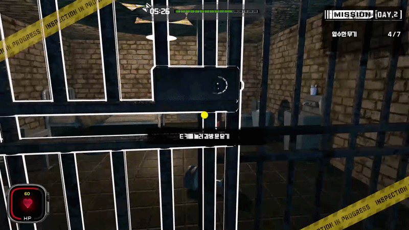

# 🎮 근무 중 이상 무 (ON DUTY: ALL CLEAR)



[](https://store.steampowered.com/app/4417570/_/)

## 게임 개요

| 항목 | 내용 |
| :--- | :--- |
| **타이틀** | 근무 중 이상 무 (ON DUTY: ALL CLEAR) |
| **장르** | #3D, #1인칭, #타임어택, #관찰, #액션, #시뮬레이션 |
| **플랫폼** | PC (Steam) |
| **플레이 타임** | 15분~1시간 |
| **배경** | 매일 사건 사고가 발생하는 교도소 제 7구역 |
| **목표** | 매일 주어지는 랜덤 미션을 클리어 해 무사고 날짜를 갱신하기 |
| **승리 조건** | 무사고 날짜를 7일까지 갱신 |
| **패배 조건** | 미션 실패 or HP가 0이 됨 |
| **팀원 구성** | 이준혁(기획), 손준형(개발), 유원영(개발), 임성규(개발), 장현우(개발, 아트) |
| **제작 기간** | 2025.12~2026.03 |
| **출시일** | 2026.03.21(Steam) |

---

### 🎯 기획 의도

1. **관찰을 넘어 직접 행동하는 게임**
   - <8번 출구>와 <Paper, Please>와 같은 게임은 문제 상황을 발견했을 때 플레이어가 할 수 있는 행동이 제한적이다. 되돌아가거나, 통과시키지 않거나. 문제를 찾아도 플레이어는 수동적인 관찰자에 머문다.
   - 하지만, <근무 중 이상 무>에서는 문제를 해결하기 위해 직접 행동한다. 감방 안을 직접 뒤지고, 금지 물품을 압수하고, 죄수를 때려 제압한다. 단순한 관찰과 클릭에서 벗어나 디테일한 1인칭 상호작용을 통해 플레이어가 실제로 무언가를 해내고 있다는 느낌을 주고자 했다.

2. **반복되는 루프에 긴장감을 부여**
   - 감방을 수색하고, 죄수를 제압하는 행위를 계속 반복하는 것은 단조롭고 지루하다.
   - 반복 과정에서 지루함 대신 긴장감과 도전 욕구를 느낄 수 있도록 두 가지 구조를 더했다.  단 한 번의 실패가 모든 것을 초기화 시키는 구조, 그리고 미션마다 제한 시간을 부여하는 타임어택. 타임 어택은 실수를 유발하고, 초기화 구조는 그 실수를 뼈아프게 만든다. 이 두 가지를 결합해 단조로운 반복을 긴장감 있는 루프로 바꾸고자 했다.

3. **같은 규칙, 매일 다른 경험**
   - 아무리 긴장감이 있더라도, 똑같은 행위를 매번 반복하는 것은 불쾌하고 지친다.
   - 이를 해소하기 위해 미션의 종류를 다양하게 구성하고, 죄수 배치와 이상 오브젝트 위치를 플레이마다 무작위로 섞었다. 단순 액션부터 관찰, 논리 추리까지 미션의 성격도 다양하게 만들었다. 같은 규칙 아래 랜덤성을 부여해 플레이 할 때마다 이전 플레이와 다르다는 느낌을 받을 수 있도록 기획했다.

---

### 🎮 플레이 개요

- 플레이어가 게임을 시작하면 `무사고 날짜`=`0`
- 플레이어는 매일 서로 다른 종류의 랜덤 미션을 진행한다.
    1. 사무실 층의 교도소장에게 말을 걸어 미션을 받고
    2. 감방 층으로 내려가 미션을 진행하고
    3. 사무실 층의 교도소장에게 돌아와서 미션에 대해 보고한다.
- 제한 시간 내 미션 클리어에 성공했을 경우 `무사고 날짜`가 추가되고(`+=1`)
제한 시간 내 미션 클리어에 실패했을 경우 `무사고 날짜`가 초기화된다. (`==0`)
- 플레이어는 `무사고 날짜`=`7`이 될 때까지 미션을 반복한다.
플레이어가 연속으로 미션 클리어에 성공해 `무사고 날짜`=`7`이 되면 게임 클리어.

---

### 🕹️ 조작 키 (Control Keys)
| 기능 | 키 바인딩 | 기능 | 키 바인딩 |
| :--- | :--- | :--- | :--- |
| **이동** | `W`, `A`, `S`, `D` | **상호작용** | `E` |
| **달리기** | `SHIFT` | **시점 조작** | 마우스 이동 |
| **앉기** | `CTRL` | **공격** | 마우스 좌클릭 |
| **점프** | `SPACE` | **상세 보기 - 오브젝트 회전** | 마우스 우클릭 |
| **일시 정지** | `ESC` | **상세 보기 - 추가 상호작용** | 마우스 좌클릭 |

# 프로젝트 개발 상세 내역

## 👤 손준형

# Key System Architecture

## 1. Daily Mission System (데이터 주도적 미션 설계)
게임의 날짜별로 달라지는 목표와 규칙을 코드 수정 없이 데이터(ScriptableObject) 교체만으로 관리할 수 있도록 설계했습니다.

### • 구조 (Structure)
* **DailyMissionManager**: 미션의 생명주기(Start -> Progress -> End)를 관리하는 중앙 컨트롤러.
* **MissionDayTheme (SO)**: 날짜별 환경 설정(제한 시간, 날씨, 조명 등)을 담은 데이터 에셋.
* **DailyMissionStrategy (Abstract)**: 미션 로직의 핵심. Collection, Suppression, Interrogation 등 구체적인 미션 목표를 상속받아 구현.

### • 기술적 특징 (Key Features)
* **OCP (Open-Closed Principle) 준수**: 새로운 미션 타입 추가 시 기존 매니저 코드를 수정하지 않고 Strategy 클래스만 확장하면 됩니다.
* **Hot-Swapping**: 기획 단계에서 3일 차 미션 데이터를 5일 차로 드래그 앤 드롭하는 것만으로 게임 플로우 변경 가능.

### • 코드 예시 (C#)
```csharp
// 코드 예시: 전략 패턴을 활용한 미션 세팅
public override void SetupDay(AnomalyDistributor ad, PrisonerScheduleManager sm) {
    // 전략 클래스가 각 매니저에게 '데이터 세팅'을 지시 (Orchestration)
    sm.AssignRolesForNewDay(suspiciousCount: 3, defaultAI: PrisonerAIType.Good);
    ad.FilterAnomalies(this.missionTheme);
}
```
## 2. Entity Spawn & Placement (역할 분담 및 조율)
미션 전략(Strategy)이 내린 지시를 바탕으로, 각 매니저가 본연의 역할에 집중하여 객체를 생성하고 배치합니다.

* **워크플로우 (Workflow)**
    1. **PrisonerScheduleManager (The Brain)**:
        * 전체 죄수 명단(Roster) 관리 및 역할(Role) 배정.
        * "오늘의 용의자", "난동 피울 죄수" 등의 메타 데이터를 생성하여 저장.
    2. **AnomalyDistributor (The Inventory)**:
        * 미션 테마에 맞는 이상현상 아이템(밀수품, 흉기) 풀(Pool)을 필터링.
        * 죄수의 성향(Trait)에 맞춰 특정 감방에 아이템을 확률적으로 분배.
    3. **PrisonerSpawnController (The Builder)**:
        * 위 두 매니저의 데이터를 참조하여 실제 게임 월드에 Prefab을 인스턴스화(Instantiate).
        * 특수 외형(Visual Anomaly)이나 미션 전용 프롭(Prop) 배치 담당.

* **해결 과제:**
    * 대소문자 구분 문제로 인한 특정 죄수(Suspect) 소환 오류를 `StringComparison.OrdinalIgnoreCase` 필터링 로직으로 해결하여 안정성 확보.

---

## 3. Prisoner AI (FSM - Finite State Machine)
죄수의 복잡한 행동 패턴을 상태(State) 단위로 모듈화하여 관리 및 확장이 용이하도록 구현했습니다.

* **FSM 구조**
    * **PrisonerFSM**: 상태 머신 컨트롤러. 현재 상태를 유지하고 전이를 담당.
    * **BasePrisonerState**: 모든 상태의 부모 클래스. Enter, Update, Exit, OnDamaged 가상 함수 제공.

* **주요 상태 (States)**
    * **Idle / Wander

---

## 👤 유원영

## 1. EventBus 기반 공통 구조
* **EventBus (공통 인프라)**
    * 시스템 간 직접 참조 제거를 위한 중앙 이벤트 허브
    * QTE, 상세보기, UI, 애니메이션, 카메라 연출 간 결합도 최소화
    * 모든 흐름은 **Subscribe / Publish** 기반으로 연결됨

---

## 2. QTE 트리거 & 진입 계층
* **QTEDistanceTrigger**
    * 죄수 접근 기반 QTE 트리거
    * 플레이어 접근 + 상세보기 상태를 고려하여 QTE Armed/Disarmed 제어
    * QTE 시작 시 `PrisonerQTEContext.SetAttacker()` 설정 후 `QTEStartedEvent` 발행
    * **oneShot** 옵션으로 1회성 QTE 제어
* **QTETrigger**
    * 단순 Collider 기반 QTE 트리거
    * 플레이어 진입 시 즉시 QTE 시작
    * 테스트용 / 보조 트리거 용도

---

## 3. QTE 상태 및 데이터 컨텍스트
* **PrisonerQTEContext (Static)**
    * QTE 전체 흐름의 공유 상태 저장소
    * 현재 공격자, QTE 액션, 결과, 데미지 소비 여부 관리
    * 중복 데미지 / 중복 애니메이션 문제 방지의 핵심
    * **Resolver**가 데미지를 소비한 시점에 **Clear** 수행

---

## 4. QTE 로직 & 진행 제어
* **QTEController (Pure Logic)**
    * QTE 시간, 입력, 성공/실패 판정 담당
    * UI / 애니메이션과 완전히 분리된 순수 로직 클래스
    * **Tick** 기반 시간 감소, **Mash** 입력 누적 처리
    * 종료 시 `QTEEndedEvent` 및 결과 이벤트 발행

---

## 5. QTE UI & 입력 처리
* **QTEPresenter**
    * QTE 시작/종료 이벤트 수신
    * QTE UI Root 활성/비활성 관리
    * `QTEController` 생성 및 **Update Tick** 연결
    * `QTEInputReader` 생성/해제
    * QTE 시작 시 상세보기 강제 종료

---

## 6. QTE 연출 디렉션 계층
* **QTEFlowDirector**
    * QTE 전체 연출 흐름

---

## 👤 임성규 (Im Sung-gyu)

---

### 1. GameManager (The Heart of State & Data)
**GameManager**는 게임의 전역적인 상태를 관리하고 시스템 간 데이터를 동기화하는 **Central Authority**입니다.

* **Finite State Machine (FSM)**: `GamePhase`를 정의하여 Standby, Briefing, Patrol, Settlement 등 각 페이즈에 따른 게임 로직의 진입과 퇴장을 제어합니다.
* **Data Persistence & Recovery**: 
    * `SaveManager`와 연동하여 현재 날짜, 체력, 미션 진행 상태 및 죄수 배치 데이터를 관리합니다.
    * `ResetAllSimulationData`를 통해 새 게임 시작 시 이전 세션의 데이터가 남지 않도록 데이터 무결성을 보장합니다.
* **Time Attack System**: 순찰 페이즈(Patrol)에서의 타임 제한 기능을 관리하며, 타임아웃 발생 시 `EventBus`를 통해 즉각적인 실패 처리를 수행합니다.
* **Event-Driven Communication**: 싱글톤 인스턴스를 유지하되, 대부분의 상태 변화를 `EventBus`를 통해 발행하여 다른 시스템과의 의존성을 최소화했습니다.

---

### 2. FlowController (The Vein of Scene & Flow)
**FlowController**는 씬 로딩과 게임의 물리적인 흐름을 제어하는 **Scene Management Framework**입니다.

* **Async Additive Loading**: `LoadSceneAsync`의 **Additive** 모드를 활용하여 로딩 씬(`LoadingScene`)을 오버레이한 상태에서 배경에서 실제 플레이 씬을 로드/언로드하는 고성능 로딩 시스템을 구현했습니다.
* **Robust Scene Transition**: 
    * `IsBusy` 플래그를 통해 로딩 중 중복 요청을 방지합니다.
    * 씬 전환 전 `UIHardResetEvent` 및 `InputHardResetEvent`를 발행하여 이전 씬의 잔재(이벤트 구독, 입력 잠금 등)를 완전히 청소(Cleanup)합니다.
* **Run-Table Recovery**: 이어하기(`LoadGameSequence`)나 재시작 시, `DailyMissionManager`와 협력하여 섞여 있던 미션 리스트 순서를 그대로 복원하는 로직을 갖추고 있습니다.
* **Timeline Integration**: 엔딩(Outro) 진행 시 `PlayableDirector`와 연동하여 타임라인 재생이 완료될 때까지 대기한 후 자동으로 인트로 씬으로 복귀시키는 자동화된 시퀀스를 지원합니다.
* **Fallback Sequence**: 근무 실패 시 튜토리얼을 건너뛰고 바로 Standby 페이즈로 재진입하는 `RestartFromFailureSequence`를 통해 사용자 경험(UX)을 개선했습니다.

---

### 3. Dialogue System (SO & 키워드 매핑 기반)
**DialogueManager**는 게임 내 모든 텍스트 상호작용을 총괄하며, 데이터 기반의 확장성을 가집니다.

* **Robust Input Handling (입력 가드 시스템)**:
    * **E-Key Release Guard**: 대화 진입 시 상호작용 키(E)가 눌려 있는 상태(`IsPressed`)를 감지하여, 키를 떼기 전까지는 대화가 넘어가거나 끊기지 않도록 `WaitContinueReleaseThenEnable` 루틴을 적용했습니다.
    * **Input Guard Timer**: 대화 시작 후 0.25초간 입력을 무시하여 의도치 않은 대화 스킵을 원천 차단했습니다.
* **Realtime Typing Logic**: `Time.timeScale`이 0인 일시정지 상태에서도 대화가 끊기지 않도록 `WaitForSecondsRealtime` 캐싱 알고리즘을 사용하여 타이핑 효과를 구현했습니다.
* **Context-Aware Content (동적 텍스트 치환)**: `DailyMissionManager`와 연동하여, 대화 내용 중 미션 관련 데이터(예: 용의자 이름 등)를 런타임에 동적으로 치환(`GetProcessedText`)하여 출력합니다.
* **Memory Optimization**: `maxVisibleCharacters` 속성을 사용하여 매 프레임 문자열을 새로 생성하지 않고 렌더링 범위만 조절하는 방식으로 메모리 가비지 생성을 최소화했습니다.

---

### 4. Tutorial System (Flow & Interaction Guide)
**튜토리얼 시스템**은 신규 플레이어가 교도소 관리 메커니즘을 학습할 수 있도록 `FlowController`와 긴밀하게 협력합니다.

* **Phase-Driven Progression**: `GamePhase.Tutorial` 상태를 정의하여 일반 게임 루프와 분리된 독립적인 튜토리얼 씬(`08_TutorialScene`)을 운영합니다.
* **Event-Based Stepping**: 특정 동작(예: 죄수 조사, 아이템 사용)을 완료했을 때 발행되는 이벤트를 수신하여 다음 단계로 넘어가는 이벤트 기반 시퀀스를 채택했습니다.
* **Conditional Input Blocking**: 학습에 필요한 최소한의 입력만 허용하고 나머지 인터랙션을 차단하여 플레이어가 의도된 가이드를 따를 수 있도록 제어합니다.
* **Tutorial Skip Logic**: 재시작(`RestartFromFailureSequence`) 시 튜토리얼 단계를 건너뛰고 바로 본 게임(Standby)으로 진입하는 로직을 통해 반복 플레이의 피로도를 낮췄습니다.

## 👤  장현우

---

## 🔧 Technical Highlights

### 1. FSM-based Player Control System
플레이어 조작을 **FSM(State Machine)** 구조로 재설계하여 상태별 책임을 명확히 분리했습니다.
* **상태 관리**: 이동, 점프, 낙하, 착지, 공격, 사망 등의 행동을 독립적인 State로 관리.
* **논리적 분리**: 상태 전환 규칙을 명시적으로 정의해 조건문 난립 및 버그 추적 문제 해결.
* **표현과 로직의 분할**: 애니메이션은 표현 중심(Blend Tree), 로직은 FSM 중심으로 분리하여 확장성 확보.

**[Result]**
* 높은 가독성과 유지보수성 확보.
* 신규 상태 추가 시 기존 로직 수정 최소화.
* 애니메이션·사운드·연출 연계가 쉬운 구조 완성.

---

### 2. Interactive Object Highlighting System
플레이어 시점 기준 **Ray 기반 상호작용 판별 시스템**을 구현했습니다.
* **셰이더 제작**: URP Shader Graph를 활용한 아웃라인 강조 셰이더 제작.
* **최적화**: `MaterialPropertyBlock`을 사용해 머티리얼 인스턴스 생성 없이 상태 제어(런타임 성능 최적화).
* **모듈화**: 상호작용 오브젝트에 컴포넌트 방식으로 즉시 적용 가능한 구조 설계.

**[Result]**
* 상호작용 가능한 오브젝트를 플레이어가 직관적으로 인지 가능.
* 렌더링 성능 저하 없이 다수 오브젝트에 적용 가능.
* 색상, 조건, 거리 기반 강조 등 기능 확장 용이.

---

### 3. Impact-Driven Ragdoll System
공격 방향과 힘을 반영한 **물리 기반 레그돌 시스템**을 구현했습니다.
* **타격 계산**: 무기 공격력, 방향 벡터, 힘 배율, 최소 충격값을 조합한 정밀한 물리 연산.
* **연출 강화**: **Upward Bias**를 적용해 단순히 쓰러지는 것이 아닌, 현실적인 피격 연출 강화.
* **상태 안정성**: 레그돌 전환 이후 순수 물리 상태로 분리하여 기존 애니메이션 상태와의 충돌 방지.

**[Result]**
* 매 타격마다 다른 물리 반응으로 타격감 대폭 향상.
* 전투 연출의 반복성 감소 및 현실감 증대.
* 새로운 무기 및 특수 공격 타입 확장이 쉬운 구조 확보.
